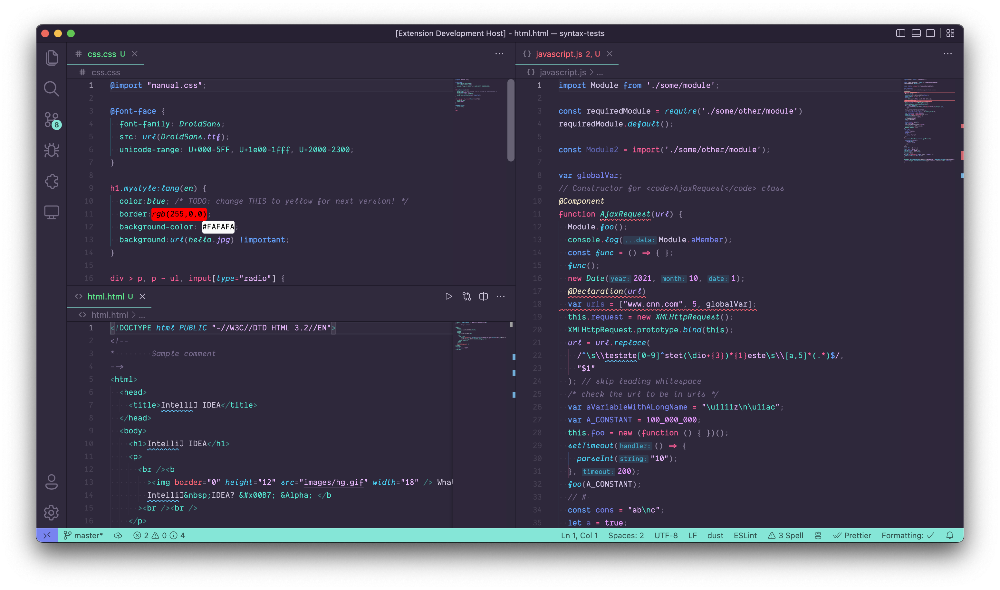

# Calm Days, Sober Nights 🏙🌃

A detail-tweaked Visual Studio Code theme for the day light and night darkness coders

## Day Light

## Night Darkness

# Installation

1.  Install [Visual Studio Code](https://code.visualstudio.com/)
2.  Launch Visual Studio Code
3.  Choose **Extensions** from activity bar
4.  Search for `calm days, sober nights`
5.  Click **Install** to install it
6.  Click **Reload** to reload VSCode
7.  From the menu bar click: Code > Preferences > Color Theme > **Calm Days, Souber Bights**

## Notes

This is my first attempt into crafting a theme, so if you see something I've missed out or have an improment idea please feel free to [file an issue](https://github.com/giovanicascaes/calm-days-sober-nights-theme-vscode/issues). I'm sure this theme can be improved some way!

## Acknowledgements

This theme has the following inspirations:

- [Ayu Themes](https://github.com/ayu-theme/vscode-ayu)
- [Horizon Theme](https://github.com/jolaleye/horizon-theme-vscode)
- [Beautiful UI](https://github.com/swashata/vscode-beautiful-ui)
- [Aylin](https://github.com/AhmedAbdulrahman/aylin-vscode-theme)
- macOS light theme

Syntax examples were grabbed from [syntax-highlight-samples](https://github.com/uloco/syntax-highlighting-samples)

## Donations

If you like this theme and feel it deserves, you can send me a donation via PayPal. Thanks! =)

## License

[MIT](https://github.com/giovanicascaes/calm-days-sober-nights-theme-vscode/blob/master/LICENSE.md)