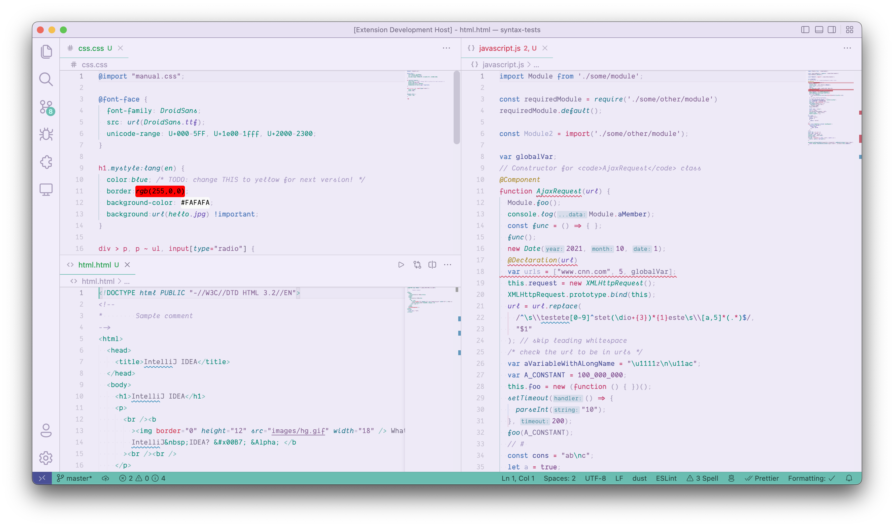

# Calm Days, Sober Nights 🏙🌃

A Visual Studio Code theme for the day light and night darkness coders.

There's 4 versions available:
- **Calm Days, Sober Nights - Night**
- **Calm Days, Sober Nights - Day**
- **Calm Days, Sober Nights - Night (no bold style)**
- **Calm Days, Sober Nights - Day (no bold style)**

An icon theme is available as well, which is actually the great [Quill Icons](https://github.com/cdonohue/vscode-quill-icons) with color and opacity adjusted to better fit this theme:
- **Calm Days, Sober Nights (Quill icons)**

## Day

## Night

# Installation

1.  Install [Visual Studio Code](https://code.visualstudio.com/)
2.  Launch Visual Studio Code
3.  Choose **Extensions** from activity bar
4.  Search for **calm days sober nights**
5.  Click **Install** to install it
6.  From the menu bar click: *Code > Preferences > Color Theme* and choose one of the four **Calm Days, Sober Nights** theme flavours

## Acknowledgements

This theme has the following inspirations:

- [Ayu Themes](https://github.com/ayu-theme/vscode-ayu)
- [Horizon Theme](https://github.com/jolaleye/horizon-theme-vscode)
- [Beautiful UI](https://github.com/swashata/vscode-beautiful-ui)
- [Aylin](https://github.com/AhmedAbdulrahman/aylin-vscode-theme)
- [ray.so's Breeze Theme](https://ray.so)
- [Floating UI code snippets theme](https://floating-ui.com)
- macOS light theme
- [Quill Icons](https://github.com/cdonohue/vscode-quill-icons)

Syntax examples were grabbed from [syntax-highlight-samples](https://github.com/uloco/syntax-highlighting-samples)

## Donations

If you like this theme and feel it deserves, you can send me a donation via PayPal. Thanks! =)

## License

[MIT](https://github.com/giovanicascaes/calm-days-sober-nights-theme-vscode/blob/master/LICENSE.md)